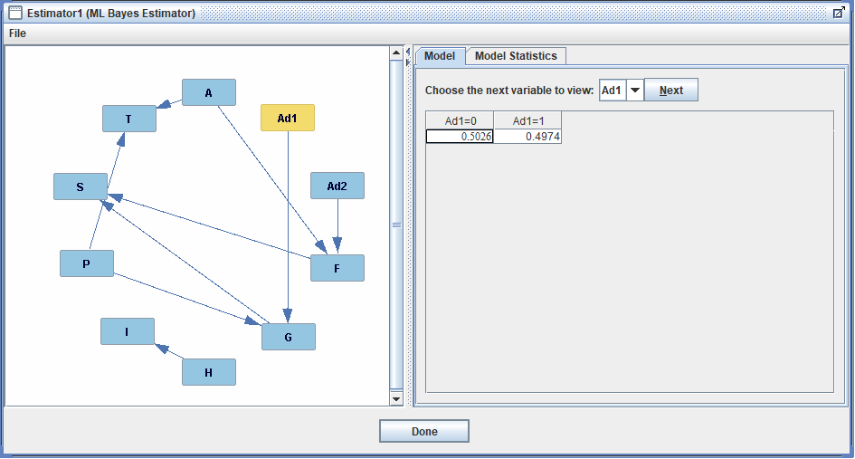

##  Homework 3: Having a Bayes Ball
####  Sam Chami and John Scott

###  I. Bayesian Network Modeling

Include the following in your report:

1.  Capture some output for your report by taking a picture of the network structure (can drag the nodes around to make it prettier).
>  

2.  Look up the PC Structure Learning algorithm and write a short summary on how it orients edges in the network structure.
>  The PC Structure Learning Algorithm uses statistical tests to determine conditional independents between variables. The algorithm starts by checking for independence among each variables. Wherevers a variable is found to be dependent of another, an undirected link is formed between the two nodes. The algorithm then finds all possible "colliders", which are variables and independence statements that cross and direct a link. (E.g.: In the above graph, F -> S <- G was determined via a collider). After this, links are formed and put in place for all nodes of the graph. The algorithm then calls for any undirected links (as there is no guarantee that every direction will be picked), and picks a random direction. This is meant to complete the graph and causes no harm because the directions can be manually switched because of human intuition.

3.  Explain, using the theory behind this algorithm, why it was able to orient some edges but not others. Reference the graph you found above.
>  In many cases, some graphs are complicated enough to not have an obvious conditional independence among variables. While colliders will always have directed links, conditional dependencies can exist, but not be easily identifiable to the algorithm.

###  II. Decision Network Modeling

In a small paragraph, argue for whether or not you believe this practice should be considered ethical, especially if each individual's characteristics were collected via social media. Compare this practice to targeted political advertising wherein ads are curated based on perceived in-group.
>  We believe that the use of artificial intelligence in choosing the best advertisement to show an individual  is ethical because of the type of information that is being analyzed. If a human was given these 8 different information points about a person, they would likely be able to infer the proper ad to run. Therefore, the AI behind this is doing what humans do already. What we find unethical, however, is the secretive nature in which this information is usually collected and presented. It is likely to be collected by a social media website and used unbeknownst to the user. If the social media platform utilizing this strategy was to notify the user with a message as simple as "This is a targeted ad", then there would be no issue. If users do not know they are seeing targeted ads, their perception of their website, the population, and the company behind the ad becomes skewed. This practice can become dangerous, as it encourages an environment in which people's beliefs and viewpoints are being affirmed, especially when ads are more political. Targeted political ads already occur frequently in places with obvious political demographics, but since social media is used by a younger, often less politically aware audience, ads chosen based on a user's specific interests may influence their views down the road, especially if the user does not know the ad is targeted.
